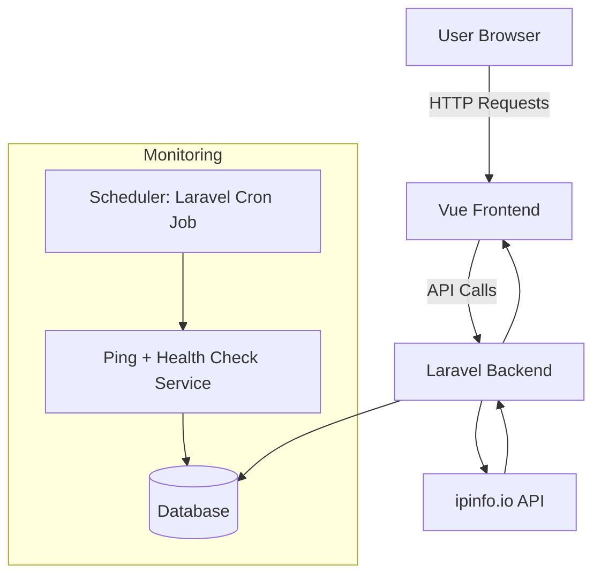

# Uptime Monitor Dashboard 

Uptime Monitor Dashboard is a lightweight, real-world monitoring tool that blends **website uptime checks**, **latency monitoring**, and **public IP intelligence** into a clean, simple dashboard. It is designed as a fast MVP built with **Laravel (backend)** and **Vue (frontend)**, yet extensible enough to grow into a fully featured monitoring platform.

The project aims to deliver a tool that entrepreneurs, developers, and small businesses can actually use.

---

## Features

### **Website Uptime & Latency Monitoring**

* Add any website URL to monitor.
* Backend periodically checks:

  * Online/offline status
  * Response time (ms)
  * Last successful check
* Automatic detection of downtime and slow responses.
* Lightweight scheduler using Laravel Jobs.

### **Public IP & Network Intelligence**

* Displays real-time client details:

  * Public IP
  * ISP / ASN
  * Country & City
  * Timezone
  * Device type
* Powered by ipinfo.io free endpoint.

### **Unified Dashboard (Vue)**

* Website health status cards.
* Latency charts for each monitored URL.
* Public IP information displayed instantly.
* Real-time UI updates via polling.

---
Preview

---
## Tech Stack

### **Backend – Laravel**

* Routes for managing monitored URLs
* API for returning uptime results
* Scheduled cron jobs for periodic checks
* Simple and clean controller logic

### **Frontend – Vue**

* Components for:

  * URL input and listing
  * Real-time latency charts
  * Current IP information
* Polling logic for live updates

### **Database – MySQL (LAMP stack standard)**

* Stores monitored URLs (MySQL)
* Stores historical check logs (MySQL)
* Stores historical check logs

---

## Architecture

---

## API Overview

### **Public IP Endpoint**

* Returns client network details using ipinfo.io

### **Monitor Management**

* Add/remove websites
* Retrieve all monitored sites

### **Health Logs**

* Fetch status + response time history for charts

---

## Setup Instructions

1. Clone repository and install dependencies.
2. Configure `.env` file.
3. Run migrations.
4. Start Laravel server.
5. Start Vue frontend.
6. Configure cron to run Laravel scheduler.

---

## Future Enhancements

* SMS/Email alerts for downtime
* Multi-region latency testing
* Webhook notifications
* Authentication & user accounts
* Multi-device dashboard mode
* Advanced analytics

---

## License

MIT License

---

## Contributions

Contributions, ideas, and improvements are welcome. Open issues or submit pull requests to help evolve Uptime Monitor Dashboard into a more robust monitoring platform.
